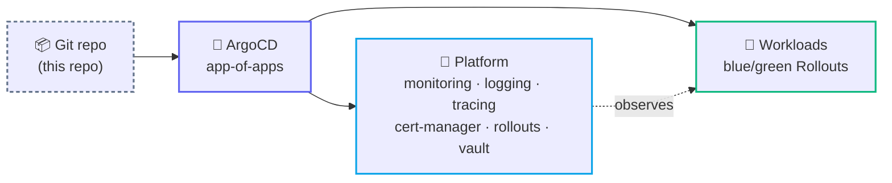

<div align="center">

# ⚙️ DevOps Lab

**Production-grade, cloud-agnostic infrastructure templates — Kubernetes, GitOps, IaC.**

Helm charts · a full ArgoCD platform · Terraform · Ansible — all validated, all secret-free.

<br/>


<br/>


</div>

---

## 🗺️ At a glance



---

## 🌟 Highlights

| Component | What it demonstrates |
|-----------|----------------------|
| 🧠 **[helm-charts/redis-stack-cluster](helm-charts/redis-stack-cluster)** | 6-node Redis Stack cluster (RediSearch + RedisJSON) — self-healing `nodes.conf` IP reconciliation, bootstrap Job, PDB, exporter, non-root securityContext, opt-in NetworkPolicy. |
| 🟦🟩 **[helm-charts/argo-rollouts-blue-green](helm-charts/argo-rollouts-blue-green)** | Progressive delivery with **Argo Rollouts** — active/preview services, a working k6 pre-promotion gate, preview ingress, HPA/PDB, matching ArgoCD Application. Runs out of the box; toggles to a plain Deployment. |
| 🐙 **[gitops/](gitops)** | A complete **ArgoCD app-of-apps platform**: metrics, logs, tracing, TLS/DNS, progressive delivery, secrets — plus a copy-me nginx blue/green workload. |
| 🚗 **[observability/vehicle-telemetry](observability/vehicle-telemetry)** | A full **observability vertical slice**: exporter → 10 alert rules with promtool unit tests → 14-panel Grafana dashboard → Compose *and* a Helm chart (rules as a PrometheusRule, dashboard as a ConfigMap) → an AI agent that triages firing alerts. Ships a mock data source, so `--profile demo` runs the whole stack with live data and no hardware. |
| 🤖 **[mcp/ansible-ops](mcp/ansible-ops)** | An **MCP server** that turns an Ansible control node into 17 tools an AI assistant can call — playbooks with dry-run, vault, SSH, Docker and diagnostics. Hosts resolve from your inventory; a runnable example tree is included. |
| 🔭 **[mcp/observability-ops](mcp/observability-ops)** | An **MCP server** over Prometheus / Loki / Alertmanager — 13 tools for PromQL, LogQL, alerts, targets, rules and silences. Read-only unless you opt in, so an assistant can investigate but not mute your paging. |

---

## 📂 Repository map

```text
devops/
├── helm-charts/     → Kubernetes Helm charts (redis · blue/green · event-exporter)
├── gitops/          → ArgoCD app-of-apps platform + nginx workload
├── terraform/       → Infrastructure as Code (cloud web server)
├── ansible/         → Configuration-management roles (redis · haproxy · exporters · etcd)
├── observability/   → End-to-end monitoring slices (vehicle-telemetry)
├── mcp/             → MCP servers for AI-assisted ops (ansible-ops · observability-ops)
└── python/          → Tooling & scripts
```

Every folder has its own README with architecture diagrams, a config reference, and validation steps.

---

## 🚀 Quick starts

<details open>
<summary><b>Redis Stack cluster</b></summary>

```bash
helm upgrade --install redis ./helm-charts/redis-stack-cluster \
  -n redis --create-namespace -f ./helm-charts/redis-stack-cluster/values-production.yaml
```
</details>

<details>
<summary><b>Blue/green app (Argo Rollouts)</b></summary>

```bash
helm upgrade --install tobrazo-app ./helm-charts/argo-rollouts-blue-green \
  -n tobrazo-app --create-namespace
kubectl argo rollouts get rollout tobrazo-app -n tobrazo-app
```
</details>

<details>
<summary><b>GitOps platform (app-of-apps)</b></summary>

```bash
kubectl apply -f gitops/clusters/prod/project-platform.yaml
kubectl apply -f gitops/clusters/prod/project-tobrazo.yaml
kubectl apply -f gitops/clusters/prod/apps/platform-root.yaml
kubectl apply -f gitops/clusters/prod/apps/workloads-root.yaml
```
</details>

<details>
<summary><b>Vehicle-telemetry stack — runs with no hardware</b></summary>

```bash
cd observability/vehicle-telemetry/compose-stack
docker compose --env-file .env.demo --profile demo up -d --build
```
Grafana on http://localhost:3000 — no login in demo mode, dashboard already provisioned,
mock telemetry already flowing.
</details>

---

## ✅ Validation

All Helm charts pass `helm lint` and render with `helm template`; the kustomize dirs build.

```bash
helm lint ./helm-charts/redis-stack-cluster
helm lint ./helm-charts/argo-rollouts-blue-green
helm lint ./gitops/workloads/nginx
```

> [!NOTE]
> The blue/green and nginx charts use Argo Rollouts CRDs. The `gitops/` platform installs them (`argo-rollouts` at sync-wave `-5`); install them before applying those charts to a live cluster.

---

## 🤖 Working with Claude Code

This repo is set up to be driven with [Claude Code](https://claude.com/claude-code):

- **`CLAUDE.md`** — project guidance (conventions, architecture, the company-neutral / secret-free invariant).
- **`.claude/settings.json`** — a safe permission allowlist so routine checks run without prompts.
- **`.claude/skills/`** — repo-specific workflows:

  | Skill | Use it to |
  |-------|-----------|
  | `validate-charts` | lint + render every chart, build kustomize, check ArgoCD refs |
  | `new-workload` | scaffold a new blue/green workload into the app-of-apps |
  | `sanitize-check` | scan for secrets / stray identifiers before committing |

---

## 🔐 A note on secrets

> [!IMPORTANT]
> This repo is a **template**. Every credential is a placeholder (`REPLACE_WITH_*`, `changeme`) or a reference to a Kubernetes `Secret` / Vault you provide. **Nothing here is a live secret** — create your own before deploying.
