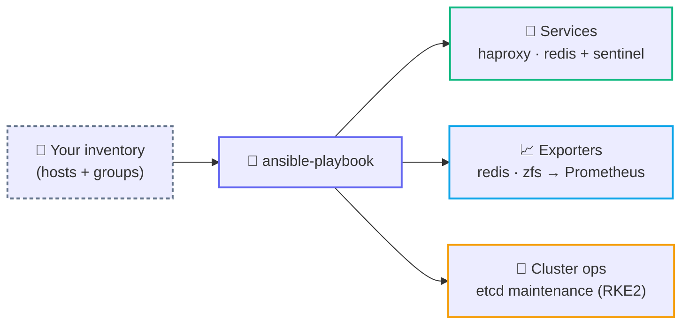

<div align="center">

# 🤖 Ansible Roles

**Standalone configuration-management roles & playbooks — bare-metal services, Prometheus exporters, and cluster ops.**

Each directory is self-contained: an example playbook at the root plus a `roles/` tree.

<br/>


</div>

---

## 🗺️ At a glance



---

## 🧱 Roles & playbooks

| Role / directory | What it does | Playbook |
|------------------|--------------|----------|
| 🔀 **[ansible-haproxy-reverse-proxy-role](ansible-haproxy-reverse-proxy-role%20)** | Installs and configures HAProxy as a reverse proxy for JSON-RPC and WebSocket backends (e.g. an Ethereum Geth + Lighthouse node). | `install_haproxy.yml` |
| 🧠 **[ansible-redis-cluster-role](ansible-redis-cluster-role)** | Deploys a Redis master/replica pair plus a Sentinel quorum with AUTH and automatic failover. | `redis.yml` |
| 📈 **[ansible-redis-exporter-role](ansible-redis-exporter-role)** | Installs the Redis Exporter as a systemd service, exposing Redis metrics to Prometheus on `:9121`. | `redis_exporter.yml` |
| 💾 **[ansible-zfs-exporter-role](ansible-zfs-exporter-role)** | Installs the ZFS Exporter as a systemd service, exposing ZFS filesystem metrics to Prometheus on `:9134`. | `zfs_exporter.yml` |
| 🔧 **[etcd-maintenance](etcd-maintenance)** | Safely compacts and defragments `etcd` on an RKE2 Kubernetes cluster. | `etcd-maintenance.yml` |
| 📊 **[prometheus-configs](prometheus-configs)** | Prometheus + Alertmanager configuration and per-exporter alert rules, with a GitLab CI pipeline that lints and deploys them. | _config bundle — no playbook_ |

---

## 🚀 How to run a role

Every role ships an example playbook at its root. Point Ansible at your own inventory and run it:

```bash
ansible-playbook -i inventory.ini <playbook>.yml
```

For example, to install the Redis Exporter:

```bash
cd ansible-redis-exporter-role
ansible-playbook -i inventory.ini redis_exporter.yml
```

> [!NOTE]
> These roles use `become: true` (they install packages and manage systemd units), so the SSH user needs sudo. Bring your own `inventory.ini` — the examples use RFC-1918 placeholder addresses (`10.0.0.x`, `192.168.x.x`).
