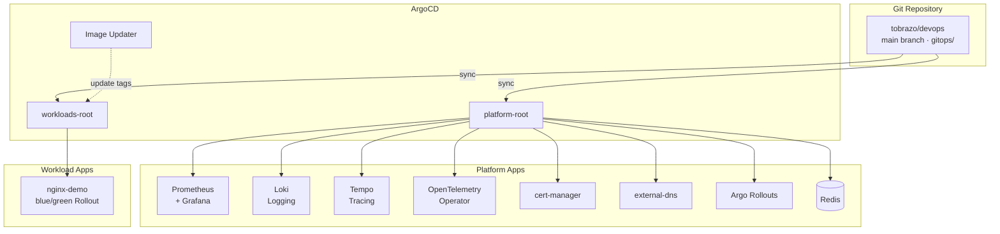
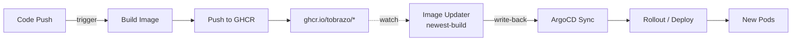
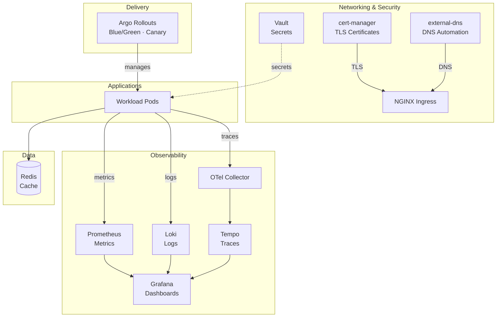

# GitOps Platform


A **reusable ArgoCD app-of-apps template** with everything a new project needs on day one: metrics, logs, tracing, TLS/DNS, progressive delivery, secrets, and real-time messaging — plus a ready-to-copy **nginx** workload wired as an Argo Rollouts blue/green deployment.

Drop a new `Application` into `clusters/<env>/apps/workloads/` and the recursing root picks it up automatically.

---

## Architecture Overview



---

## CI/CD Flow



---

## Directory Structure

```text
gitops/
├── clusters/
│   └── prod/                         # Single-cluster app-of-apps
│       ├── project-platform.yaml     # AppProject: platform
│       ├── project-tobrazo.yaml      # AppProject: tobrazo (workloads)
│       └── apps/
│           ├── platform-root.yaml    # app-of-apps root (platform)
│           ├── workloads-root.yaml   # app-of-apps root (workloads)
│           ├── platform/             # Platform components (Applications)
│           └── workloads/            # Workload Applications (nginx-prod)
├── platform/                         # Shared platform manifests / charts
│   ├── cert-manager-external-dns/    # ClusterIssuer + DNS token secret
│   ├── monitoring/                   # Prometheus, Grafana, dashboards
│   ├── logging/                      # Loki, event-exporter
│   ├── otel/                         # OpenTelemetry operator, Tempo
│   ├── vault/                        # HashiCorp Vault runbook + RBAC
│   ├── argo-rollouts/                # Progressive delivery values
│   ├── image-updater/                # argocd-image-updater values
│   ├── redis/                        # bitnami redis values
│   └── centrifugo/                   # Real-time messaging chart
├── workloads/
│   └── nginx/                        # Example nginx blue/green Rollout chart
└── reset-argocd-apps.sh              # Recovery script
```

> Single cluster, namespace-per-component. Argo Rollouts CRDs are installed by
> the `argo-rollouts` platform app (chart-managed), so the nginx workload's
> `Rollout` resolves on first sync.

---

## Root Applications

Two root ArgoCD Applications manage everything (app-of-apps):

| Application | Path | Project | Purpose |
|-------------|------|---------|---------|
| `platform-root` | `gitops/clusters/prod/apps/platform/` | `platform` | Infrastructure components |
| `workloads-root` | `gitops/clusters/prod/apps/workloads/` | `tobrazo` | Application deployments |

Both use `directory.recurse: true` — child Applications are discovered automatically, so adding a workload is just dropping a YAML file into the `workloads/` folder.

---

## Bootstrap

```bash
# 1) AppProjects
kubectl apply -f clusters/prod/project-platform.yaml
kubectl apply -f clusters/prod/project-tobrazo.yaml

# 2) Root applications (app-of-apps)
kubectl apply -f clusters/prod/apps/platform-root.yaml
kubectl apply -f clusters/prod/apps/workloads-root.yaml

# 3) Watch it converge
argocd app list
argocd app get platform-root
```

> Before syncing, create the required Secrets referenced by the platform (they are **not** committed): the cert-manager/external-dns Cloudflare API token (`platform/cert-manager-external-dns/secrets.yaml` — placeholders), Grafana admin password, and the Alertmanager Discord webhook. See the placeholders in `platform/monitoring/kube-prometheus/values*.yaml`.

---

## Workloads Sync Order

Applications deploy in order using `sync-wave` annotations. This template ships a single demo workload:

| Wave | Application | Namespace |
|------|-------------|-----------|
| 1 | nginx-prod | nginx-demo |

Add more workloads at higher waves as needed (backend → frontend → …).

---

## Platform Stack



---

## Platform Components

| Component | Chart/Source | Namespace | Purpose |
|-----------|--------------|-----------|---------|
| kube-prometheus-stack | prometheus-community | monitoring | Metrics & Grafana |
| loki-stack | grafana | logs | Log aggregation |
| tempo | grafana | tempo | Distributed tracing |
| opentelemetry-operator | open-telemetry | otel | Auto-instrumentation |
| cert-manager | jetstack | cert-manager | TLS certificates |
| external-dns | kubernetes-sigs | kube-system | DNS automation |
| argo-rollouts | argoproj | argo-rollouts | Progressive delivery |
| argocd-image-updater | argoproj | argocd | Image auto-updates |
| centrifugo | in-tree chart | centrifugo | Real-time messaging |
| vault | hashicorp | vault | Secrets management |
| redis | bitnami | redis | In-memory cache |

---

## Image Updater

Workload Applications can carry ArgoCD Image Updater annotations:

```yaml
annotations:
  argocd-image-updater.argoproj.io/image-list: app=ghcr.io/tobrazo/app
  argocd-image-updater.argoproj.io/app.update-strategy: newest-build
  argocd-image-updater.argoproj.io/app.pull-secret: pullsecret:argocd/ghcr-creds
  argocd-image-updater.argoproj.io/write-back-method: argocd
```

New images are detected and the tag is written back into the Application automatically.

---

## Adding a New Workload

1. Add a Helm chart under `workloads/<app-name>/` (copy `workloads/nginx/` as a starting point).

2. Add an ArgoCD Application in `clusters/prod/apps/workloads/<app-name>-prod.yaml`:

```yaml
apiVersion: argoproj.io/v1alpha1
kind: Application
metadata:
  name: <app-name>-prod
  namespace: argocd
  annotations:
    argocd.argoproj.io/sync-wave: "<priority>"
spec:
  project: tobrazo
  source:
    repoURL: https://github.com/tobrazo/devops
    path: gitops/workloads/<app-name>
    targetRevision: main
  destination:
    server: https://kubernetes.default.svc
    namespace: <namespace>
  syncPolicy:
    automated:
      prune: true
      selfHeal: true
    syncOptions:
      - CreateNamespace=true
```

3. Commit and push — the recursing `workloads-root` picks it up and ArgoCD syncs.

---

## Roadmap / TODOs

- Store webhook URLs and API tokens in Vault (out of Git).
- Add NetworkPolicies for workload isolation.
- Add a canary example alongside the blue/green nginx workload.
