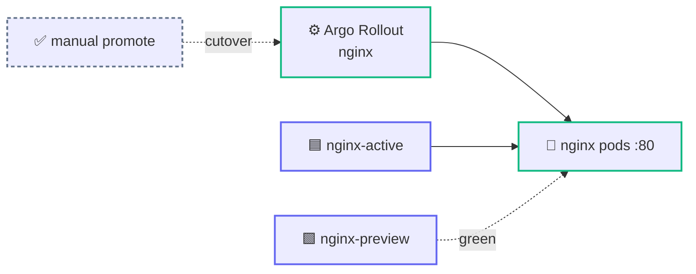

<div align="center">

# 🌐 nginx — Blue/Green Workload

**A minimal Argo Rollouts blue/green example: two nginx pods behind active + preview services. Copy it as the starting point for a new workload.**


</div>

---

The smallest useful **Argo Rollouts blue/green** chart: a single container, an active (blue) Service and a preview (green) Service, and manual promotion. It's deployed to the `nginx-demo` namespace by ArgoCD via [`gitops/clusters/prod/apps/workloads/nginx-prod.yaml`](../../clusters/prod/apps/workloads/nginx-prod.yaml) — a good template to clone with the `new-workload` skill.

## 🏗️ Architecture



The Rollout controller injects the pod-hash into the Service selectors, moving live traffic from the active Service to the new ReplicaSet only when you promote. `nginx-prod.yaml` uses `ignoreDifferences` on the Service selectors so ArgoCD doesn't fight that.

## ⚙️ Configuration

| Value | Default | Purpose |
|-------|---------|---------|
| `image.repository` / `image.tag` | `nginx` / `1.27-alpine` | Container image. |
| `replicaCount` | `2` | Desired pod count. |
| `service.activeName` | `nginx-active` | Active (blue) Service name. |
| `service.previewName` | `nginx-preview` | Preview (green) Service name. |
| `service.port` / `service.targetPort` | `80` / `80` | Service port and container port. |
| `rollout.autoPromotionEnabled` | `false` | `false` = new version waits on the preview Service until you promote. |
| `rollout.scaleDownDelaySeconds` | `30` | How long the old ReplicaSet lingers after promotion (fast rollback). |
| `pdb.enabled` / `pdb.minAvailable` | `false` / `1` | Optional PodDisruptionBudget. |
| `ingress.enabled` / `ingress.host` | `false` / `nginx.example.com` | Optional ingress routed to the active Service. |

## 🚀 Quick start

```bash
# Render / install directly
helm template nginx ./gitops/workloads/nginx
helm upgrade --install nginx ./gitops/workloads/nginx -n nginx-demo --create-namespace
```

Watch and promote the rollout:

```bash
kubectl argo rollouts get rollout nginx -n nginx-demo --watch
kubectl argo rollouts promote nginx -n nginx-demo
```

Try it locally against the active Service:

```bash
kubectl -n nginx-demo port-forward svc/nginx-active 8080:80
# then open http://localhost:8080
```

> [!NOTE]
> The chart renders an Argo `Rollout`, so the Argo Rollouts CRDs must be installed in the cluster before it applies. The `gitops/` platform installs them (`argo-rollouts` at sync-wave `-5`).

## ✅ Validation

```bash
helm lint ./gitops/workloads/nginx
helm template nginx ./gitops/workloads/nginx
```
