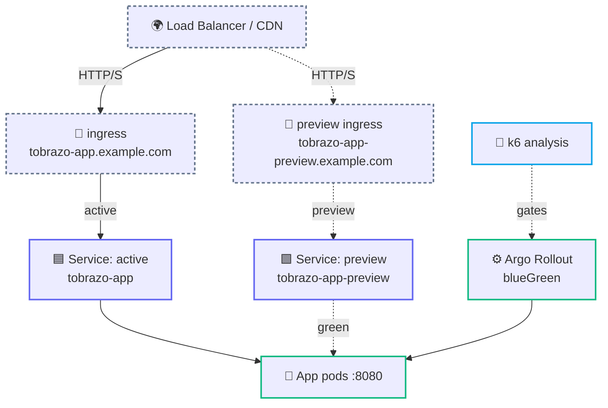
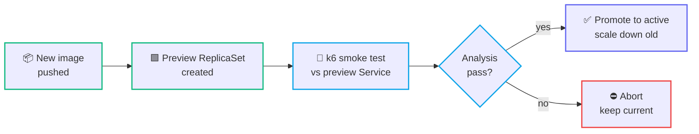

<div align="center">

# 🔀 Argo Rollouts Blue/Green

**A self-contained blue/green delivery chart — active/preview services, a real k6 pre-promotion gate, and a matching ArgoCD Application. Runs out of the box.**


</div>

---

An example Helm chart for **blue/green delivery with Argo Rollouts**, GitOps-managed by ArgoCD. It demonstrates a full progressive-delivery setup you can drop onto any web/API workload. The same chart renders **either** an Argo `Rollout` (blue/green) **or** a plain `Deployment`, selected by `controller.type`.

The default image is a **runnable public** one (`nginxinc/nginx-unprivileged`, non-root, listens on `8080`), so `helm install` works with no extra setup — swap `image.*` for your own app.

## 🏗️ Architecture



## 🔁 Blue/green strategy



Live traffic stays on the **active** service while the new version comes up behind the **preview** service. `prePromotionAnalysis` runs a k6 Job against the in-cluster preview Service; only if it passes is the rollout promotable. With `autoPromotionEnabled: false` the cutover is a manual `promote`, and `scaleDownDelaySeconds: 30` keeps the old ReplicaSet briefly for fast rollback.

```mermaid
flowchart LR
  code["📝 Code push"] -->|trigger| build["🔨 Build image"]
  build --> push["📤 Push to registry"]
  push --> updater["👁️ Image Updater<br/>newest-build"]
  updater -->|write-back tag| sync["🐙 ArgoCD sync"]
  sync --> rollout["⚙️ Argo Rollout"]
  rollout --> analysis["🧪 k6 analysis"]
  analysis -->|pass / fail| promote["✅ Promote / ⛔ abort"]

  classDef deliver stroke:#10b981,stroke-width:2px;
  classDef ctrl stroke:#6366f1,stroke-width:2px;
  classDef obs stroke:#0ea5e9,stroke-width:2px;
  classDef edge stroke:#64748b,stroke-width:2px,stroke-dasharray:4 3;
  class code,build,push edge; class updater,sync,rollout ctrl; class analysis,promote obs;
```

<details>
<summary><b>CI/CD flow (with argocd-image-updater)</b></summary>


</details>

## 🧱 What's inside

- **Argo Rollout** — blue/green with a preview ReplicaSet and manual (or automated) promotion.
- **k6 AnalysisTemplate** — a pre-promotion smoke test that gates the cutover, targeting the internal preview Service.
- **Services** — active (blue), preview (green), and a stable Service for Deployment mode.
- **Ingress** — an NGINX ingress plus a dedicated preview ingress, with CORS and rate-limiting annotations.
- **HPA / PDB** — horizontal scaling (targets the Rollout) and a disruption budget.
- **ConfigMap / Secret** — runtime config via `envFrom` (the Secret is referenced `optional`, never committed).
- **ArgoCD Application** — `application.yaml`, with `ignoreDifferences` for the rollout-managed Service selectors.

## ⚙️ Configuration

| Value | Default | Purpose |
|-------|---------|---------|
| `controller.type` | `rollout` | `rollout` for Argo Rollouts (blue/green), `deployment` for a plain Deployment. |
| `replicaCount` | `2` | Desired pod count for the active stack. |
| `image.repository` / `image.tag` | `nginxinc/nginx-unprivileged` / `1.27-alpine` | Runnable public default (non-root, `:8080`). Swap for your app. |
| `service.activeName` / `service.previewName` | `tobrazo-app` / `tobrazo-app-preview` | Active (blue) and preview (green) Service names. |
| `service.port` / `service.targetPort` | `80` / `8080` | Service port and container target port. |
| `config.*` | see `values.yaml` | Rendered into a ConfigMap consumed via `envFrom`. |
| `secret.name` / `secret.create` | `app-secrets` / `false` | Name of a Secret with sensitive env (created out-of-band by default; no secret in git). |
| `hpa.enabled` | `true` | HorizontalPodAutoscaler targeting the Rollout (2→4 replicas @ 80% CPU). |
| `pdb.enabled` | `true` | PodDisruptionBudget (`minAvailable: 50%`). |
| `podSecurityContextEnabled` / `containerSecurityContextEnabled` | `false` | Opt-in non-root + dropped-capabilities hardening. |
| `ingress.enabled` / `ingress.annotations` | `true` | Preview/main ingress with CORS, rate limiting, TLS via cert-manager. |
| `domains.main` / `domains.preview` | `*.example.com` | Ingress hostnames (placeholder domains). |

<details>
<summary><b>Config essentials (values.yaml excerpt)</b></summary>

```yaml
# values.yaml (default = blue/green Rollout)
controller:
  type: rollout            # or "deployment" for a plain Deployment

image:
  repository: nginxinc/nginx-unprivileged   # runnable public default
  tag: "1.27-alpine"

service:
  activeName: tobrazo-app
  previewName: tobrazo-app-preview
  port: 80
  targetPort: 8080

config:                    # rendered into a ConfigMap (envFrom)
  NODE_ENV: production
  REDIS_HOSTS:
    - redis://redis-cluster-0.redis-cluster.redis.svc.cluster.local:6379
```
</details>

<details>
<summary><b>Chart structure</b></summary>

```text
argo-rollouts-blue-green/
├── Chart.yaml
├── values.yaml                # default: blue/green Rollout
├── values-deployment.yaml     # overlay: plain Deployment mode
├── application.yaml           # ArgoCD Application
├── files/k6s/smoke.js         # k6 smoke test (targets PREVIEW_URL)
└── templates/
    ├── _helpers.tpl
    ├── rollout.yaml            # Argo Rollout (controller.type=rollout)
    ├── deployment.yaml         # Deployment (controller.type=deployment)
    ├── service-active.yaml     # active/blue Service
    ├── service-preview.yaml    # preview/green Service
    ├── service.yaml            # stable Service (deployment mode)
    ├── ingress.yaml
    ├── ingress-preview.yaml
    ├── configmap.yaml
    ├── configmap-k6s.yaml      # mounts smoke.js for the analysis Job
    ├── analysis-templates.yaml # k6 AnalysisTemplate (pre-promotion gate)
    ├── secret.yaml             # optional, disabled by default
    ├── hpa.yaml
    └── pdb.yaml
```
</details>

> [!NOTE]
> The pre-promotion k6 gate targets the **in-cluster preview Service** — `http://<previewName>.<namespace>.svc.cluster.local:<port>/` — so it genuinely exercises the green stack before promotion, not a public URL.

## 🚀 Quick start

```bash
# Blue/green Rollout (default)
helm upgrade --install tobrazo-app . -n tobrazo-app --create-namespace

# Plain Deployment mode
helm upgrade --install tobrazo-app . -n tobrazo-app --create-namespace \
  -f values-deployment.yaml
```

Drive the rollout:

```bash
kubectl argo rollouts get rollout tobrazo-app -n tobrazo-app
kubectl argo rollouts promote tobrazo-app -n tobrazo-app
kubectl argo rollouts abort   tobrazo-app -n tobrazo-app
```

**GitOps:** apply `application.yaml` to let ArgoCD manage it (repoURL points at `github.com/tobrazo/devops`, path `helm-charts/argo-rollouts-blue-green`).

## ✅ Validation

```bash
helm lint .
helm template tobrazo-app .                              # blue/green Rollout
helm template tobrazo-app . -f values-deployment.yaml    # plain Deployment
helm template tobrazo-app . | kube-score score -
helm template tobrazo-app . | kube-linter lint -
```

> [!IMPORTANT]
> Rendering the `Rollout` / `AnalysisTemplate` requires the Argo Rollouts CRDs installed in the cluster at apply time. The `gitops/` platform in this repo installs them (`argo-rollouts` at sync-wave `-5`).
