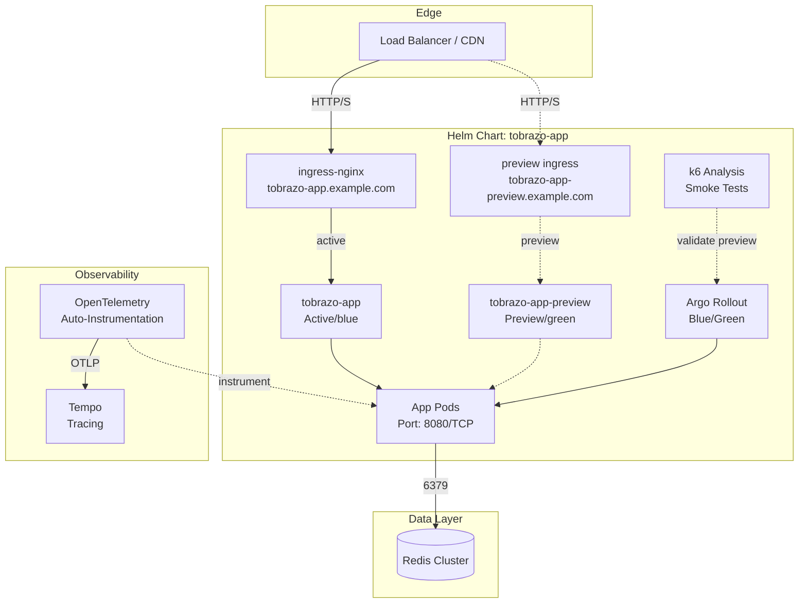
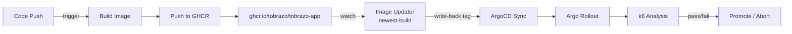
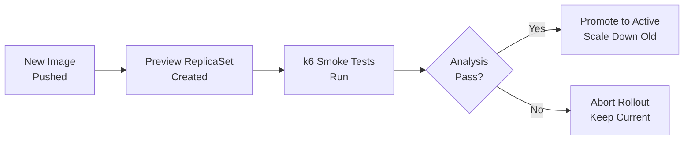

# tobrazo-app — Argo Rollouts Blue/Green


A self-contained example Helm chart for **blue/green delivery with Argo Rollouts**, GitOps-managed by ArgoCD. It demonstrates a full progressive-delivery setup you can drop onto any web/API workload.

The same chart renders **either** an Argo `Rollout` (blue/green) **or** a plain `Deployment`, controlled by `controller.type`.

---

## What's Inside

- **Argo Rollout** — blue/green with a preview ReplicaSet and manual (or automated) promotion
- **k6 Analysis** — pre-promotion smoke test that gates the cutover
- **Services** — active (blue), preview (green), and a stable service for Deployment mode
- **Ingress** — NGINX ingress + a dedicated preview ingress, CORS and rate-limiting
- **HPA / PDB** — horizontal scaling (targets the Rollout) and disruption budget
- **ConfigMap / Secret** — runtime config via `envFrom` (secrets referenced, never committed)
- **ArgoCD Application** — `application.yaml`, with `ignoreDifferences` + argocd-image-updater wiring

---

## Architecture



---

## CI/CD Flow



---

## Blue/Green Strategy



The Rollout keeps live traffic on the **active** service while the new version comes up behind the **preview** service. `prePromotionAnalysis` runs a k6 Job against the preview host; only if it passes is the rollout promotable (`autoPromotionEnabled: false` → manual promote). `scaleDownDelaySeconds` keeps the old ReplicaSet briefly for fast rollback.

---

## Config Essentials

```yaml
# values.yaml (default = blue/green Rollout)
controller:
  type: rollout            # or "deployment" for a plain Deployment

image:
  repository: ghcr.io/tobrazo/tobrazo-app
  tag: "1.0.0"

domains:
  main: tobrazo-app.example.com
  preview: tobrazo-app-preview.example.com

config:                     # rendered into a ConfigMap (envFrom)
  NODE_ENV: production
  REDIS_HOSTS:
    - redis://redis-cluster-0.redis-cluster.redis.svc.cluster.local:6379
```

| Parameter | Description |
|-----------|-------------|
| `controller.type` | `rollout` for Argo Rollouts (blue/green), `deployment` for a standard Deployment |
| `service.name` / `service.previewName` | Active (blue) and preview (green) Service names |
| `config.*` | Rendered into a ConfigMap consumed via `envFrom` |
| `secret.name` | Name of a Secret with sensitive env (created out-of-band; not in the chart) |
| `hpa.enabled` | HorizontalPodAutoscaler targeting the Rollout |
| `pdb.enabled` | PodDisruptionBudget |
| `ingress.annotations` | CORS, rate limiting, real-IP headers |

---

## Quick Start

```bash
# Blue/green Rollout (default)
helm upgrade --install tobrazo-app . -n tobrazo-app --create-namespace

# Plain Deployment mode
helm upgrade --install tobrazo-app . -n tobrazo-app --create-namespace \
  -f values-deployment.yaml
```

**Drive the rollout:**
```bash
kubectl argo rollouts get rollout tobrazo-app -n tobrazo-app
kubectl argo rollouts promote tobrazo-app -n tobrazo-app
kubectl argo rollouts abort   tobrazo-app -n tobrazo-app
```

**GitOps:** apply `application.yaml` to let ArgoCD manage it (repoURL points at `github.com/tobrazo/devops`, path `helm-charts/argo-rollouts-blue-green`).

---

## Chart Structure

```text
argo-rollouts-blue-green/
├── Chart.yaml
├── values.yaml                # default: blue/green Rollout
├── values-deployment.yaml     # overlay: plain Deployment mode
├── application.yaml           # ArgoCD Application
├── files/k6s/smoke.js         # k6 smoke test (target via -e PREVIEW_URL)
└── templates/
    ├── _helpers.tpl
    ├── rollout.yaml           # Argo Rollout (controller.type=rollout)
    ├── deployment.yaml        # Deployment (controller.type=deployment)
    ├── service-active.yaml    # active/blue Service
    ├── service-preview.yaml   # preview/green Service
    ├── service.yaml           # stable Service (deployment mode)
    ├── ingress.yaml
    ├── ingress-preview.yaml
    ├── configmap.yaml
    ├── configmap-k6s.yaml     # mounts smoke.js for the analysis Job
    ├── analysis-templates.yaml# k6 AnalysisTemplate (pre-promotion gate)
    ├── secret.yaml            # optional, disabled by default
    ├── hpa.yaml
    └── pdb.yaml
```

The default image is a **runnable public** one (`nginxinc/nginx-unprivileged`, non-root, listens on 8080) so `helm install` works out of the box — swap `image.*` for your own app. The pre-promotion k6 gate targets the in-cluster **preview Service** (`http://<previewService>.<ns>.svc:80/`), so it actually exercises the green stack before promotion.

---

## Local Validation

```bash
helm lint .
helm template tobrazo-app .                              # blue/green Rollout
helm template tobrazo-app . -f values-deployment.yaml    # plain Deployment
helm template tobrazo-app . | kube-score score -
helm template tobrazo-app . | kube-linter lint -
```

> **Note:** rendering the Rollout/AnalysisTemplate requires the Argo Rollouts CRDs installed in the cluster at apply time (the `gitops/` platform in this repo installs them).
