# 📘 Redis Stack Cluster Helm Chart


Helm chart for running a production-ready **Redis Stack Cluster** (Redis + RedisJSON + RediSearch) on Kubernetes. The chart relies on an in-container lifecycle hook to keep `nodes.conf` aligned with pod IPs, so recovery is instant after a pod reschedule.

---

## 🚀 Highlights
- Stateful Redis Stack cluster (default 3 masters + 3 replicas) with automatic sharding.
- `postStart` hook lets each pod reconcile its own `nodes.conf`; restart behaviour is flag-controlled.
- Rolling updates supported (`RollingUpdate` or `OnDelete`).
- Optional cron-based IP auditor (disabled by default) for scheduled checks.
- Redis Exporter sidecar for Prometheus metrics (latency, memory, AOF, replication state).
- Optional PodDisruptionBudget and pod anti-affinity spreading pods across nodes.

---

## 🧱 What the Chart Deploys
- `StatefulSet` with Redis Stack + (optional) Redis Exporter containers.
- Headless + ClusterIP Services (`redis-cluster`, `redis`, `redis-metrics`).
- ConfigMap with a parametrised `redis.conf` and the smart `fix-ip.sh` script.
- Helm hook Job `redis-cluster-init` to bootstrap the cluster on install/upgrade.
- Optional CronJob (`redis-ip-check`) with RBAC when `redisFixCronjob.enabled=true`.

---

## ⚙️ Key Configuration
| Value | Purpose |
|-------|---------|
| `namespace` | Target namespace for all resources. |
| `image` | `redis/redis-stack:7.4.0-v7` (multi-arch). Pin another release here. |
| `storage.className` | StorageClass for the PVCs. `""` = cluster default; set your own (e.g. `gp3`, `do-block-storage`, `standard`). |
| `fixIP.enabled` | Toggles the `postStart` IP-reconciliation hook; `maxWaitSeconds` / `retryIntervalSeconds` tune readiness waits. |
| `redisConfig` | High-level `redis.conf` switches (maxmemory, io-threads, appendonly, save, …). |
| `redisFixCronjob.enabled` | Renders the optional CronJob + RBAC (default `false`). |
| `redisExporter.enabled` | Prometheus exporter sidecar (default `true`). |
| `podDisruptionBudget.enabled` | Renders a PDB (default `false`; on in the production overlay). |
| `affinity.enabled` / `affinity.type` | Optional nodeAffinity by node instance-type. |

---

## 📂 Chart Layout
```
redis-stack-cluster/
├── Chart.yaml
├── values.yaml               # sane cloud-agnostic defaults
├── values-production.yaml    # HA overlay (bigger resources, PDB on)
└── templates/
    ├── statefulset.yaml       # postStart hook calls fix-ip.sh --max-wait ...
    ├── redis-ip-fix-script.yaml
    ├── redis-fix-cronjob.yaml # conditional (redisFixCronjob.enabled)
    ├── job-init-cluster.yaml  # helm hook: bootstraps the cluster
    ├── service-headless.yaml
    ├── service-node.yaml
    ├── service-metrics.yaml
    ├── pdb.yaml               # conditional (podDisruptionBudget.enabled)
    └── configmap.yaml
```

---

## 🛠️ Local Validation
```bash
helm lint ./redis-stack-cluster
helm template redis ./redis-stack-cluster -f values-production.yaml
helm template redis ./redis-stack-cluster -f values-production.yaml | kube-score score -
helm template redis ./redis-stack-cluster -f values-production.yaml | kube-linter lint -
```

---

## 🚢 Deploy / Upgrade
```bash
kubectl create namespace redis   # one-time
helm upgrade --install redis ./redis-stack-cluster -n redis -f values-production.yaml --wait
```
After rollout:
```bash
kubectl get pods -n redis
kubectl logs -n redis redis-cluster-0 -c redis | head
```
You should see `Waiting for Redis to become ready...` followed by `IP addresses are consistent — nothing to do`.

---

## 🔁 Lifecycle Flow

```mermaid
flowchart TB
  Client["🌍 Client / Service"] --> SVC["🚪 ClusterIP Service\nredis"]

  subgraph CLUSTER["☸️ Namespace: redis"]
    direction LR
    SVC --> Pod0["🧱 redis-cluster-0"]
    SVC --> Pod1["🧱 redis-cluster-1"]
    SVC --> Pod2["🧱 redis-cluster-2"]
    SVC --> Pod3["🧱 redis-cluster-3"]
    SVC --> Pod4["🧱 redis-cluster-4"]
    SVC --> Pod5["🧱 redis-cluster-5"]

    Pod0 --> Hook0["⚙️ postStart\nfix-ip.sh"]
    Hook0 --> Conf0["📄 /data/nodes.conf"]
  end

  Pod0 -- metrics --> Exporter0["📈 redis-exporter :9121"]

  classDef default fill:#1e1e1e,stroke:#666,color:#fff,font-size:14px,font-family:monospace,rx:8,ry:8
  classDef accent fill:#0078d7,stroke:#66aaff,color:#fff,font-weight:bold
  class Client accent
  style CLUSTER fill:#111,stroke:#444,stroke-width:1px,rx:10,ry:10
```


---

## 📊 Observability
With `redisExporter.enabled=true`:
- Metrics exposed at `:9121/metrics` (sidecar) and via the `redis-metrics` Service.
- Includes Redis core + cluster stats (AOF, latency histograms, replication, memory).
- Scrape with a Prometheus `ServiceMonitor` selecting `app: redis-cluster`.

Example Grafana alerts to consider:
- `redis_up == 0` (instance down).
- `redis_cluster_state == 0` (cluster not OK).
- `redis_memory_used_bytes / redis_memory_max_bytes > 0.85` (memory pressure).
- `redis_errors_total{err="LOADING"} > 0` (pods stuck loading dataset too long).

---

## 🧪 Operational Tips
- **Rolling updates**: production overlay ships `OnDelete`; switch to `RollingUpdate` with a PDB to keep a quorum during upgrades.
- **Manual failover**: `kubectl exec -n redis redis-cluster-0 -- redis-cli -p 6379 cluster failover`.
- **Rebalancing slots** (after scale changes): `redis-cli --cluster rebalance`.
- **Disabling restart** (test env): the hook supports `--no-restart` to update `nodes.conf` without bouncing Redis.

---

## 🔐 Security
The default `redis.conf` sets `protected-mode no` and `bind 0.0.0.0` so the pods can form a cluster over the pod network — this assumes Redis is reachable **only** from inside the cluster. The chart ships the idiomatic in-cluster controls:

- **`securityContext.enabled: true`** (default) — pods run non-root (`runAsUser: 1000`), drop **all** capabilities, `seccompProfile: RuntimeDefault`. Adjust `runAsUser`/`fsGroup` if your image needs a specific uid.
- **`networkPolicy.enabled`** (opt-in) — restrict `6379/16379` to the redis pods plus any clients listed in `networkPolicy.allowFrom`.
- **exec probes** — readiness/liveness use `redis-cli ping`, so a node that only bound its socket (but isn't answering) is not marked Ready.

For deployments exposed beyond the cluster, additionally layer `requirepass`/`masterauth` sourced from a Secret (bring-your-own — kept out of this example to avoid shipping a password in a ConfigMap).

---

## 🧹 Cleanup
```bash
helm uninstall redis -n redis
kubectl delete pvc -l app=redis-cluster -n redis
```
If the cron auditor was enabled:
```bash
kubectl delete cronjob redis-ip-check -n redis --ignore-not-found
kubectl delete sa redis-fix-sa -n redis --ignore-not-found
kubectl delete role redis-fix-role -n redis --ignore-not-found
kubectl delete rolebinding redis-fix-rb -n redis --ignore-not-found
```
