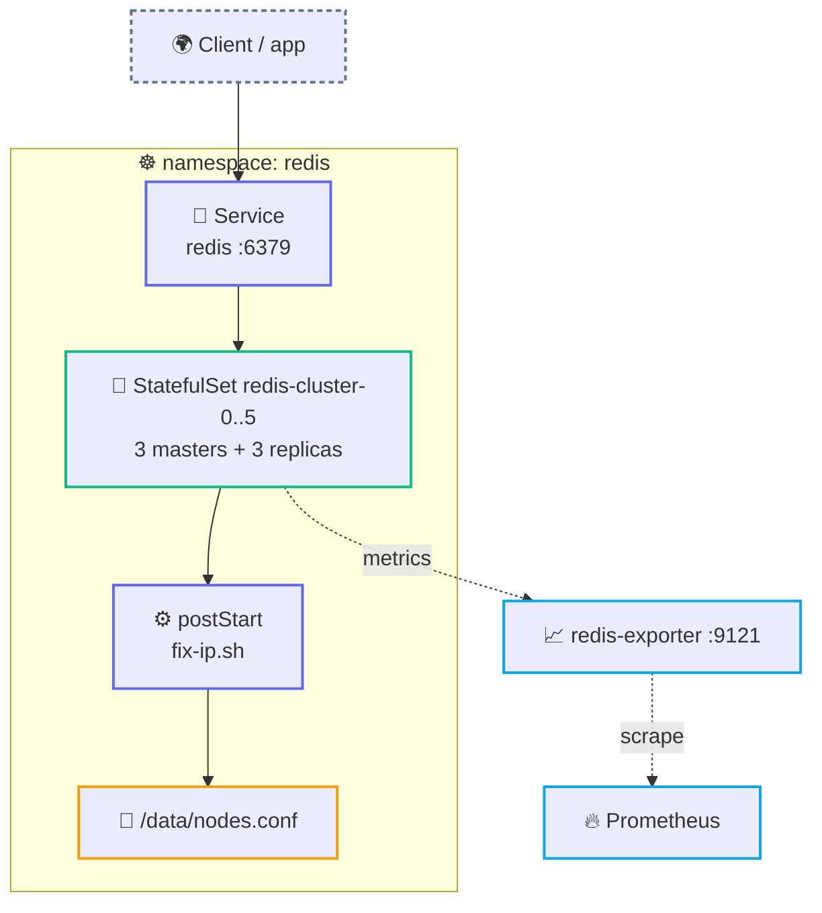

<div align="center">

# 🧠 Redis Stack Cluster

**A production-ready 6-node Redis Stack cluster (RediSearch + RedisJSON) that heals its own `nodes.conf` after a reschedule.**


</div>

---

A Helm chart for a stateful **Redis Stack Cluster** (Redis + RediSearch + RedisJSON) on Kubernetes. StatefulSet pods can pick up a new IP on reschedule, which breaks the cluster's `nodes.conf`. This chart ships an in-pod `postStart` hook that reconciles `nodes.conf` against the current pod IPs, so recovery is automatic — no manual `cluster forget` / `cluster meet` dance.

## 🏗️ Architecture



## 🧱 What's inside

- **StatefulSet** — 6 pods (3 masters + 3 replicas) running Redis Stack, with an optional `redis-exporter` sidecar.
- **Self-healing IP hook** — each pod's `postStart` runs `fix-ip.sh --max-wait … --sleep …`, waiting for Redis to answer, then reconciling `nodes.conf` when a pod IP has changed.
- **Bootstrap Job** — `redis-cluster-init` (a Helm hook) forms the cluster on install/upgrade.
- **Services** — headless (`redis-cluster`), client ClusterIP (`redis`), and metrics (`redis-metrics`).
- **ConfigMap** — a parametrised `redis.conf` (maxmemory, io-threads, AOF, snapshots) plus the mounted `fix-ip.sh`.
- **Optional CronJob** — an out-of-pod IP auditor (`redis-ip-check`) with its own RBAC, off by default.
- **Optional PDB + anti-affinity** — quorum protection and pod spreading across nodes.

## ⚙️ Configuration

| Value | Default | Purpose |
|-------|---------|---------|
| `replicaCount` | `6` | Cluster size (3 masters + 3 replicas). |
| `image.repository` / `image.tag` | `redis/redis-stack` / `7.4.0-v7` | Redis Stack image (multi-arch). |
| `storage.size` / `storage.className` | `4Gi` / `""` | PVC size and StorageClass (`""` = cluster default; set `gp3`, `do-block-storage`, `standard`, …). |
| `fixIP.enabled` | `true` | Toggles the `postStart` IP-reconciliation hook. |
| `fixIP.maxWaitSeconds` / `fixIP.retryIntervalSeconds` | `120` / `2` | Readiness wait + retry interval passed to `fix-ip.sh`. |
| `updateStrategy.type` | `RollingUpdate` | StatefulSet update strategy (`OnDelete` in the production overlay). |
| `redisConfig.*` | see `values.yaml` | `redis.conf` switches — maxmemory, `maxmemoryPolicy`, io-threads, AOF, `save`. |
| `redisExporter.enabled` | `true` | Prometheus exporter sidecar on `:9121`. |
| `redisFixCronjob.enabled` | `false` | Renders the optional out-of-pod CronJob + RBAC. |
| `podDisruptionBudget.enabled` | `false` | Renders a PDB (`true`, `minAvailable: 5` in the production overlay). |
| `securityContext.enabled` | `true` | Non-root pods, dropped capabilities, `seccompProfile: RuntimeDefault`. |
| `networkPolicy.enabled` | `false` | Opt-in NetworkPolicy restricting `6379`/`16379`. |
| `podAntiAffinity` | `soft` | `soft` (preferred) or `hard` (required) pod spreading across nodes. |
| `affinity.enabled` / `affinity.type` | `false` | Optional nodeAffinity pinning by node instance-type. |

Two overlays ship with the chart: `values.yaml` (cloud-agnostic defaults) and `values-production.yaml` (HA sizing, `OnDelete`, PDB on, larger memory budget).

<details>
<summary><b>Chart layout</b></summary>

```text
redis-stack-cluster/
├── Chart.yaml
├── values.yaml                # cloud-agnostic defaults
├── values-production.yaml     # HA overlay (bigger resources, PDB on, OnDelete)
└── templates/
    ├── statefulset.yaml        # postStart hook calls fix-ip.sh --max-wait ...
    ├── redis-ip-fix-script.yaml
    ├── redis-fix-cronjob.yaml  # conditional (redisFixCronjob.enabled)
    ├── job-init-cluster.yaml   # helm hook: bootstraps the cluster
    ├── service-headless.yaml
    ├── service-node.yaml
    ├── service-metrics.yaml
    ├── networkpolicy.yaml      # conditional (networkPolicy.enabled)
    ├── pdb.yaml                # conditional (podDisruptionBudget.enabled)
    └── configmap.yaml
```
</details>

## 🚀 Quick start

```bash
kubectl create namespace redis   # one-time

helm upgrade --install redis ./redis-stack-cluster \
  -n redis -f values-production.yaml --wait
```

After rollout:

```bash
kubectl get pods -n redis
kubectl logs -n redis redis-cluster-0 -c redis | head
```

> [!TIP]
> On a healthy start you should see `Waiting for Redis to become ready...` followed by `IP addresses are consistent — nothing to do` in the pod logs — that's the `fix-ip.sh` hook confirming `nodes.conf` matches the live pod IPs.

## ✅ Validation

```bash
helm lint ./redis-stack-cluster
helm template redis ./redis-stack-cluster -f values-production.yaml
helm template redis ./redis-stack-cluster -f values-production.yaml | kube-score score -
helm template redis ./redis-stack-cluster -f values-production.yaml | kube-linter lint -
```

## 📊 Observability

With `redisExporter.enabled=true`:

- Metrics on `:9121/metrics` (sidecar), exposed via the `redis-metrics` Service.
- Redis core + cluster stats: AOF, latency histograms, replication state, memory.
- Scrape with a Prometheus `ServiceMonitor` selecting `app: redis-cluster`.

Alerts worth wiring up: `redis_up == 0` (instance down), `redis_cluster_state == 0` (cluster not OK), `redis_memory_used_bytes / redis_memory_max_bytes > 0.85` (memory pressure).

## 🧪 Operational tips

- **Rolling updates** — the production overlay ships `OnDelete`; switch to `RollingUpdate` with a PDB to keep a quorum during upgrades.
- **Manual failover** — `kubectl exec -n redis redis-cluster-0 -- redis-cli -p 6379 cluster failover`.
- **Rebalancing slots** (after scaling) — `redis-cli --cluster rebalance`.
- **Test env** — `fix-ip.sh` supports `--no-restart` to update `nodes.conf` without bouncing Redis.

## 🔐 Security

The default `redis.conf` sets `protected-mode no` and `bind 0.0.0.0` so pods can form a cluster over the pod network — this assumes Redis is reachable **only** from inside the cluster. The chart ships the idiomatic in-cluster controls:

> [!NOTE]
> - **`securityContext.enabled: true`** (default) — pods run non-root (`runAsUser: 1000`), drop **all** capabilities, `seccompProfile: RuntimeDefault`. Adjust `runAsUser` / `fsGroup` if your image needs a specific uid.
> - **`networkPolicy.enabled`** (opt-in) — restrict `6379`/`16379` to the redis pods plus any clients listed in `networkPolicy.allowFrom`.
> - **exec probes** — readiness/liveness use `redis-cli ping`, so a node that only bound its socket (but isn't answering, e.g. still `LOADING`) is not marked Ready.

> [!IMPORTANT]
> For deployments exposed beyond the cluster, additionally layer `requirepass` / `masterauth` sourced from a `Secret` (bring-your-own — deliberately kept out of this example so no password lives in a ConfigMap). Use a placeholder such as `REPLACE_WITH_REDIS_PASSWORD` until you wire in your own secret store.

## 🧹 Cleanup

<details>
<summary><b>Uninstall and remove PVCs</b></summary>

```bash
helm uninstall redis -n redis
kubectl delete pvc -l app=redis-cluster -n redis
```

If the cron auditor was enabled (`redisFixCronjob.enabled=true`):

```bash
kubectl delete cronjob redis-ip-check -n redis --ignore-not-found
kubectl delete sa redis-fix-sa -n redis --ignore-not-found
kubectl delete role redis-fix-role -n redis --ignore-not-found
kubectl delete rolebinding redis-fix-rb -n redis --ignore-not-found
```
</details>
