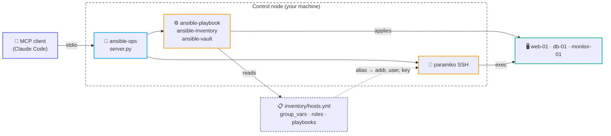

<div align="center">

# 🤖 ansible-ops — MCP server

**Drive an Ansible-managed fleet from an AI assistant: playbooks, SSH, Docker, app CLIs.**


</div>

---

An [MCP](https://modelcontextprotocol.io) server that exposes an Ansible control node as
**17 tools and 6 resources**. Point an MCP client at it and you can ask for a dry-run of a
provisioning playbook, tail a container log, or diff effective host variables — in the
conversation, without leaving it to run commands by hand.

Nothing about the target infrastructure is baked into the code. Hosts, users and SSH keys
are resolved from **your Ansible inventory**; paths and defaults come from **environment
variables**. The bundled [`example/`](example) tree makes the server runnable out of the box.

---

## 🗺️ How it works



The inventory is the single source of truth: `ansible_host`, `ansible_user` and
`ansible_ssh_private_key_file` drive the SSH tools too, so a host only has to be defined once.

---

## 🚀 Install

```bash
cd mcp/ansible-ops
python3 -m venv .venv
.venv/bin/pip install -r requirements.txt
```

Register it with your MCP client — copy [`.mcp.json.example`](.mcp.json.example) to `.mcp.json`
and adjust the paths:

```json
{
  "mcpServers": {
    "ansible-ops": {
      "type": "stdio",
      "command": "./mcp/ansible-ops/.venv/bin/python",
      "args": ["./mcp/ansible-ops/server.py"],
      "env": {
        "ANSIBLE_MCP_DIR": "/path/to/your/ansible",
        "ANSIBLE_MCP_SSH_USER": "deploy",
        "ANSIBLE_MCP_SSH_KEY": "~/.ssh/id_ed25519"
      }
    }
  }
}
```

Restart the client, then ask it to *"list the ansible hosts"* — it should call
`ansible_list_hosts` and answer without you running anything.

---

## ⚙️ Configuration

| Variable | Default | What it is |
|----------|---------|------------|
| `ANSIBLE_MCP_DIR` | `./example` | Root of the Ansible tree (`playbooks/`, `inventory/`, `roles/`) |
| `ANSIBLE_MCP_INVENTORY` | `inventory/hosts.yml` | Inventory path, relative to the root |
| `ANSIBLE_MCP_VAULT_PASS` | `<root>/.vault_pass` | Vault password file — optional; vault flags are skipped when absent |
| `ANSIBLE_MCP_SSH_USER` | `deploy` | Fallback SSH user, when the inventory sets no `ansible_user` |
| `ANSIBLE_MCP_SSH_KEY` | `~/.ssh/id_ed25519` | Fallback private key, when the inventory sets no key |

### Expected layout

```text
<ANSIBLE_MCP_DIR>/
├── ansible.cfg
├── inventory/
│   ├── hosts.yml          → hosts, groups, connection vars
│   └── group_vars/*.yml   → per-group variables (vault-encrypted secrets)
├── playbooks/*.yml        → one playbook per operation
└── roles/<role>/{defaults,tasks}/main.yml
```

`ansible_list_playbooks` reports the **first comment line** of each playbook as its
description — keep a one-liner under the `---` and the tool list documents itself.

---

## 🧰 Tools

<details open>
<summary><b>Ansible</b></summary>

| Tool | What it does |
|------|-------------|
| `ansible_run` | Run a playbook with `--limit` / `--tags` / `-e`; `check_mode=True` for a dry-run |
| `ansible_list_hosts` | Inventory hosts with their groups and address |
| `ansible_list_playbooks` | Playbooks with a one-line description |
| `ansible_list_inventories` | Inventory files |
| `ansible_get_vars` | Effective variables for a host (vault decrypted) |
| `vault_view` | Decrypt and display a vault-encrypted file |
| `vault_encrypt_string` | Encrypt a value for pasting into `group_vars` |
</details>

<details>
<summary><b>Docker</b></summary>

| Tool | What it does |
|------|-------------|
| `docker_status` | `docker ps` + `docker stats` on a host |
| `docker_logs` | Container logs (`--tail`, `--since`) |
| `docker_exec` | Run a command inside a container |
| `docker_restart` | Restart a container |
</details>

<details>
<summary><b>Application</b></summary>

| Tool | What it does |
|------|-------------|
| `magento_cli` | `bin/magento <command>` inside the PHP container |
| `redis_cli` | `redis-cli` wrapper (`INFO`, `DBSIZE`, `MEMORY USAGE` …) |
| `mariadb_query` | SQL inside the MariaDB container; the password stays in the container's env |
</details>

<details>
<summary><b>Diagnostics</b></summary>

| Tool | What it does |
|------|-------------|
| `server_resources` | Memory, load, `vmstat`, disk, top processes by RSS |
| `server_tail_nginx` | Tail the nginx access or error log |
| `server_ssh` | Arbitrary SSH command, for anything not covered above |
</details>

### Resources

Resources let the client read files without you pasting them.

| URI | Content |
|-----|---------|
| `ansible://playbooks/{name.yml}` | Playbook file |
| `ansible://inventory/{name}` | Inventory file (vault values stay encrypted) |
| `ansible://group_vars/{name.yml}` | `group_vars` file (vault values stay encrypted) |
| `ansible://roles/{role}/defaults` | Role default variables |
| `ansible://roles/{role}/tasks` | Role tasks |
| `ansible://roles/list` | All role names |

---

## 💬 Example prompts

```text
list the ansible hosts and show me which groups they are in

run site.yml against web in check mode and summarise what would change

web-01 is slow — check resources and the last 200 lines of the app container log,
then tell me what is saturating

show the effective variables for db-01 and explain where php_fpm_max_children comes from

deploy branch main to the web group, then flush the application cache

are there 502s in the nginx error log in the last hour? what is causing them?
```

---

## 🔐 Security

> [!IMPORTANT]
> This server runs **arbitrary commands on your servers** as whatever user the inventory
> specifies. Treat it as an interactive shell that an assistant can drive.

- Runs **locally** over stdio — no infrastructure detail leaves your machine.
- SSH keys are read from disk by path and never passed through a tool argument.
- Vault secrets are decrypted in memory; `vault_view` is the only tool that prints them,
  and the server never logs its own output.
- `mariadb_query` reads the password from the container's own environment, so no credential
  is placed on a command line.
- `vault_view` refuses paths that resolve outside the Ansible root.
- Every host must exist in the inventory — an unknown alias is rejected rather than
  connected to blind.
- `server_ssh`, `docker_exec` and `ansible_run` are unrestricted by design. The server's
  MCP `instructions` tell the client to dry-run changes and to confirm destructive
  operations first — that is a guardrail, not a sandbox. Point this at production only if
  you are comfortable with that.

---

## 🧪 Verify

```bash
# syntax
.venv/bin/python -m py_compile server.py

# tools are registered and the example inventory resolves
.venv/bin/python -c "import server; print(len(server._hosts()), 'hosts')"

# the example tree is valid Ansible (no connection made)
cd example && ansible-inventory -i inventory/hosts.yml --list >/dev/null && echo OK
```

---

## 🩺 Troubleshooting

**Server does not appear in the client** — check the `command` path points at the venv's
python (`ls mcp/ansible-ops/.venv/bin/python`), use absolute paths if your client does not
resolve relative ones, and restart the client after editing `.mcp.json`.

**`ansible_list_hosts` returns nothing** — `ANSIBLE_MCP_DIR` or `ANSIBLE_MCP_INVENTORY` is
wrong. Verify with `ansible-inventory -i <inventory> --list` from that directory.

**SSH errors** — test the same identity by hand: `ssh -i ~/.ssh/id_ed25519 deploy@web-01.example.com uptime`.

**Vault errors** — `vault_view` needs `ANSIBLE_MCP_VAULT_PASS` to point at an existing file;
without it the server simply runs Ansible without vault flags.
