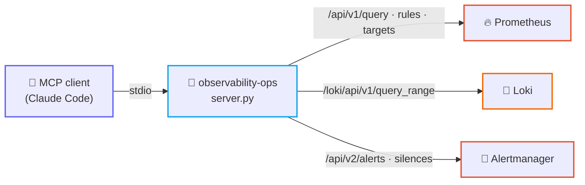

<div align="center">

# 🔭 observability-ops — MCP server

**Ask an AI assistant what your monitoring stack is actually seeing: PromQL, LogQL, alerts, targets, silences.**


</div>

---

An [MCP](https://modelcontextprotocol.io) server that turns a running Prometheus /
Loki / Alertmanager stack into **12 tools** an assistant can call mid-conversation.
Instead of alt-tabbing between three UIs to answer "why did that alert fire", you ask —
and the assistant queries the metric, charts it over the last hour, reads the logs from
the same window, and checks whether the scrape target was even up.

Nothing about the target stack is baked in: all three endpoints come from environment
variables. It works against the [vehicle-telemetry](../../observability/vehicle-telemetry)
demo stack, a `kube-prometheus-stack` port-forward, or production behind a tunnel.

---

## 🗺️ How it works



**Read-only by default.** The nine query tools cannot change anything. The two silence
tools — which decide whether humans get paged — only register when
`OBS_MCP_ALLOW_WRITE` is set, so an assistant cannot mute your alerting by accident.

---

## 🧰 Tools

| Tool | What it answers |
|---|---|
| `prom_query` | What does this metric read right now? |
| `prom_query_range` | How has it behaved over the last N minutes? (downsampled, context-window friendly) |
| `prom_metrics` | What is even being collected? (filter by substring) |
| `prom_label_values` | Which instances / jobs / devices exist? |
| `prom_targets` | Is the scrape target up, or did collection stop? |
| `prom_rules` | Which rule files loaded, and what is the exact expression? |
| `prom_alerts` | What does Prometheus consider pending or firing? |
| `loki_query` | What were the services logging at that moment? |
| `loki_labels` | Which log streams exist, and what values does a label take? |
| `am_alerts` | What survived grouping, inhibition and silencing? |
| `am_silence_create` 🔒 | Mute a matcher for N hours |
| `am_silence_expire` 🔒 | Un-mute it again |

🔒 = requires `OBS_MCP_ALLOW_WRITE`. There is also an `observability://config` resource
reporting the effective endpoints and whether writes are enabled.

The server's instructions tell the assistant to **discover before guessing** (metric
names, label values, log labels) and to **correlate before concluding** — a firing alert
plus a flat metric plus quiet logs usually means a broken exporter, not a broken service.

---

## 🚀 Install

```bash
cd mcp/observability-ops
python3 -m venv .venv
.venv/bin/pip install -r requirements.txt
```

Register it with your MCP client — copy [`.mcp.json.example`](.mcp.json.example) to
`.mcp.json` and point the URLs at your stack:

```json
{
  "mcpServers": {
    "observability-ops": {
      "type": "stdio",
      "command": "./mcp/observability-ops/.venv/bin/python",
      "args": ["./mcp/observability-ops/server.py"],
      "env": {
        "OBS_MCP_PROMETHEUS_URL": "http://localhost:9090",
        "OBS_MCP_LOKI_URL": "http://localhost:3100",
        "OBS_MCP_ALERTMANAGER_URL": "http://localhost:9093"
      }
    }
  }
}
```

---

## ⚙️ Configuration

| Var | Default | Notes |
|---|---|---|
| `OBS_MCP_PROMETHEUS_URL` | `http://localhost:9090` | |
| `OBS_MCP_LOKI_URL` | `http://localhost:3100` | |
| `OBS_MCP_ALERTMANAGER_URL` | `http://localhost:9093` | |
| `OBS_MCP_TIMEOUT` | `20` | Per-request timeout, seconds |
| `OBS_MCP_MAX_CHARS` | `12000` | Result truncation — keeps a wide query from eating the context window |
| `OBS_MCP_ALLOW_WRITE` | *(unset)* | `1`/`true` registers the two silence tools |

---

## 💬 Try it

Point it at the [vehicle-telemetry demo stack](../../observability/vehicle-telemetry)
(one command, no vehicle needed) and ask:

> *"Is anything firing? If so, chart the metric behind it over the last hour and check
> whether the exporter was actually being scraped the whole time."*

The assistant will call `prom_alerts` → `prom_rules` to read the expression →
`prom_query_range` for the trend → `prom_targets` to rule out a collection gap →
`loki_query` for what the containers logged.

---

## ✅ Validate

```bash
python3 -m py_compile mcp/observability-ops/server.py
OBS_MCP_PROMETHEUS_URL=http://localhost:9090 .venv/bin/python server.py   # stdio; Ctrl-C to exit
```

---

## 🔐 Notes

- **Read-only unless you opt in.** Silences suppress paging; keep `OBS_MCP_ALLOW_WRITE`
  unset unless you want an assistant able to create them, and prefer the narrowest
  matcher when you do.
- **Query results are data, not instructions.** Log lines come from whatever is running
  in your cluster — treat them as untrusted input, exactly as you would when reading
  them yourself.
- **No credentials are handled.** Point the URLs at endpoints you can already reach
  (localhost, a port-forward, a tunnel); the server adds no auth of its own.
