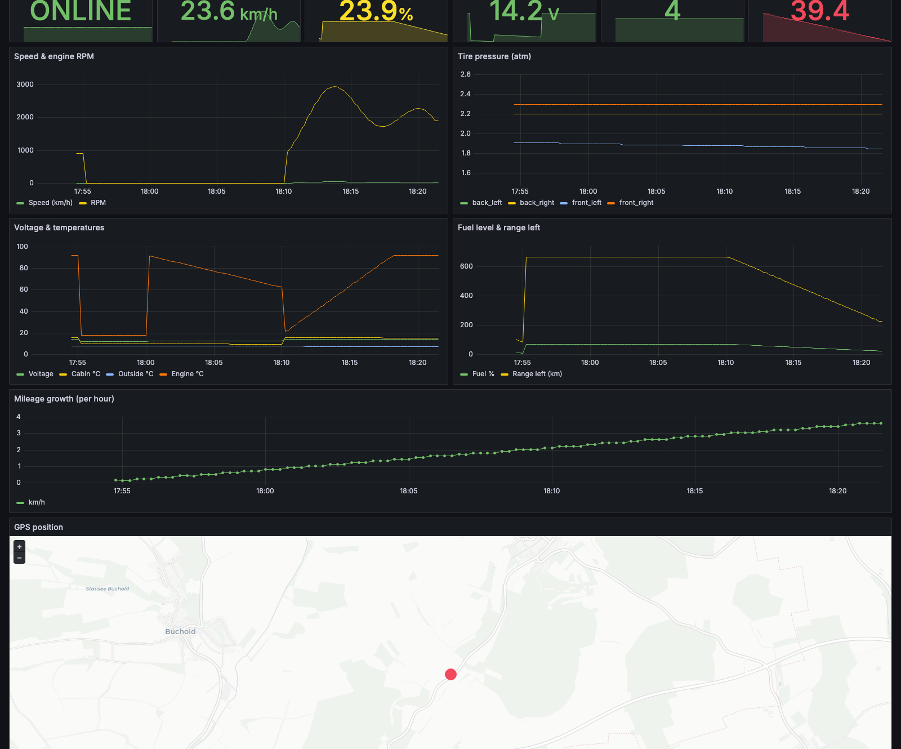
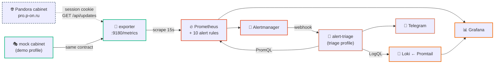

<div align="center">

# 🚗 vehicle-telemetry

**One data source, instrumented end to end: collect → store → alert → visualise → triage.**

Runs on your laptop in one command, with no vehicle and no credentials.


<br/>


</div>

---

**Pandora P-ON** car alarms expose telemetry — speed, RPM, fuel, coolant temperature,
tire pressure, GPS, SIM balance — through a web cabinet with no public API. This project
scrapes that cabinet into Prometheus and builds the whole operational stack around it:
alert rules with unit tests, a provisioned Grafana dashboard, log aggregation, two
deployment targets, and an AI agent that triages alerts before they reach a human.

The interesting part is not the vehicle. It is that a niche, undocumented, awkward data
source can be turned into a first-class observability citizen — and that the result is
**verifiable by anyone who clones the repo**, because the stack ships with a mock cabinet.

---

## 🎬 Try it — no vehicle, no account, no credentials

```bash
cd observability/vehicle-telemetry/compose-stack
docker compose --env-file .env.demo --profile demo up -d --build
```

Open **http://localhost:3000** — Grafana, no login in demo mode, dashboard already there,
data already flowing. The mock cabinet simulates a 30-minute drive cycle: the car sits
parked, the engine starts, fuel drops as the odometer climbs, coolant warms to 92 °C,
and one tire slowly deflates until `PandoraTireLow` fires.



---

## 🗺️ How it fits together



The exporter is a **singleton by design** — Pandora session cookies are not shareable, so
two replicas would fight over the session. The k8s `Deployment` pins `replicas: 1` with
`strategy: Recreate`, and the HTTP server starts *before* login so `/metrics` answers even
while credentials are being retried.

> [!WARNING]
> **Pandora has no public API.** The login flow and JSON schema here are reverse-engineered
> from the browser Network panel and can break on any Pandora UI update. Everything is
> configurable by env var (`PANDORA_LOGIN_PATH`, `_FIELD`, `_FORMAT`) precisely so a schema
> change is a config edit, not a code change. Read-only: the exporter never sends commands
> to the vehicle.

---

## 📂 Layout

```text
vehicle-telemetry/
├── exporter/          → the exporter (single file, requests + prometheus_client)
├── mock/              → fake cabinet, stdlib only — the demo profile
├── agent/             → alert-triage: Alertmanager webhook → Claude → diagnosis
├── alerts/            → 10 alert rules + 14 promtool unit tests
├── dashboards/        → 13-panel Grafana dashboard (compose + k8s share it)
├── deploy/            → Secret + Deployment + Service + ServiceMonitor, scrape config
├── docker-compose.yml → just the exporter, for an existing Prometheus
└── compose-stack/     → the whole stack: Prometheus · Alertmanager · Loki · Promtail · Grafana
```

`alerts/` and `dashboards/` are consumed by **both** the compose stack and the k8s
deploy — one source of truth for rules and dashboards.

---

## 📈 Metrics

24 metric families on `:9180/metrics`:

| Metric | Type | Labels | Meaning |
|---|---|---|---|
| `pandora_online` | gauge | `device_id` | 1 = device reachable |
| `pandora_move` | gauge | `device_id` | 1 = vehicle moving |
| `pandora_speed_kmh` | gauge | `device_id` | Current speed |
| `pandora_engine_rpm` | gauge | `device_id` | Engine RPM |
| `pandora_voltage_v` | gauge | `device_id` | Battery voltage |
| `pandora_engine_temp_c` / `pandora_cabin_temp_c` / `pandora_outside_temp_c` | gauge | `device_id` | Temperatures |
| `pandora_fuel_percent` | gauge | `device_id` | Fuel level |
| `pandora_range_to_empty_km` | gauge | `device_id` | CAN range estimate |
| `pandora_mileage_km` / `pandora_mileage_can_km` | gauge | `device_id` | Pandora vs CAN odometer |
| `pandora_tpms_atm` | gauge | `device_id`, `wheel` | Tire pressure per wheel |
| `pandora_position_lat` / `pandora_position_lon` | gauge | `device_id` | GPS position |
| `pandora_gsm_level` | gauge | `device_id` | GSM signal, 0–5 |
| `pandora_sim_balance` | gauge | `device_id`, `currency`, `phone` | SIM balance |
| `pandora_last_seen_ts` / `pandora_last_command_ts` / `pandora_last_setting_ts` | gauge | `device_id` | Unix timestamps |
| `pandora_poll_total` / `pandora_poll_errors_total` / `pandora_relogin_total` | counter | (`kind`) | Exporter self-monitoring |
| `pandora_exporter_last_poll_ts` | gauge | – | Freshness of the last good poll |

---

## ⚙️ Configuration

| Var | Required | Default | Notes |
|---|:---:|---|---|
| `PANDORA_LOGIN` | ✅ | – | Cabinet email/login — **not** the device ID |
| `PANDORA_PASSWORD` | ✅ | – | Cabinet password |
| `PANDORA_HOST` | – | `pro.p-on.ru` | `p-on.ru` for the consumer cabinet |
| `PANDORA_SCHEME` | – | `https` | `http` only for the bundled mock |
| `PANDORA_LOGIN_PATH` | – | `/api/users/login` | Change if Pandora moves the endpoint |
| `PANDORA_LOGIN_FIELD` | – | `login` | Try `email` / `username` if login is rejected |
| `PANDORA_LOGIN_FORMAT` | – | `json` | anything else → form-encoded |
| `PANDORA_DEVICE_IDS` | – | (all) | Comma-separated allowlist |
| `POLL_INTERVAL_SEC` | – | `10` | Be polite — don't go below 5 |
| `EXPORTER_PORT` | – | `9180` | Scrape port |
| `LOG_LEVEL` | – | `INFO` | `WARNING` in production (see Security) |

---

## 🔔 Alerts — and tests for them

`alerts/pandora-rules.yml` — 10 rules:

| Alert | Severity | Fires when |
|---|---|---|
| `PandoraDeviceOffline` | warning | No contact for 10 min (underground parking, jammer, pulled fuse) |
| `PandoraExporterStalled` | critical | No successful poll for 2 min |
| `PandoraLowBatteryVoltage` | warning | < 11.8 V with the engine off for 15 min |
| `PandoraTireLow` | warning | Any wheel under 1.8 atm for 30 min |
| `PandoraSimLowBalance` | warning | SIM balance < 50 — SMS notifications about to stop |
| `PandoraFuelLow` | info | Under 10 % fuel (and above 0 — a flat 0 is a dead sensor) |
| `PandoraMovingEngineOff` | critical | In motion for 2 min with the engine off — towed, pushed, or on a transporter |
| `PandoraSettingsChangedRecently` | info | Cabinet settings changed in the last 5 min (audit) |
| `PandoraHighMileageBurst` | info | > 80 km in an hour (car loaned out) |
| `PandoraEngineOverheat` | critical | Coolant over 105 °C |

Alert rules are code, so they have tests. `alerts/pandora-rules.test.yml` drives 14 cases
through `promtool`: each alert must stay silent until its `for:` window elapses and then
fire with the exact labels and rendered annotations — plus the negative cases that matter.
Those are the interesting half: low voltage while the engine is *running* must not alert;
a flat `0 %` fuel reading is a sensor fault, not an empty tank; and a start-stop system
briefly reporting zero RPM while the car rolls to a halt must not read as a tow.

```bash
cd alerts
docker run --rm --entrypoint promtool -v "$PWD":/w -w /w \
  prom/prometheus:v2.55.1 test rules pandora-rules.test.yml
```

`critical` inhibits `warning` for the same `alertname` + `device_id`. The default
Alertmanager receiver is `null`, so the stack starts with no credentials; a `telegram`
receiver and an AI `triage` receiver sit ready in
[`compose-stack/alertmanager/alertmanager.yml`](compose-stack/alertmanager/alertmanager.yml).

---

## 📊 Dashboard

`dashboards/pandora-vehicle.json` — auto-provisioned into the **Pandora** folder by the
compose stack, importable anywhere else. A `$device` template variable populates from
`label_values(pandora_online, device_id)`, so every panel follows the selected vehicle.

Six stat tiles (status, speed, fuel, battery, GSM, SIM balance) over time series for
speed/RPM, TPMS per wheel, voltage and temperatures, fuel and range, hourly mileage delta,
a geomap of the live GPS position, and a Loki logs panel with the stack's own container output.

---

## 🤖 The AI layer

Two different things, deliberately:

| | What it is | When it runs |
|---|---|---|
| 🔎 **[agent/](agent)** — alert-triage | An Alertmanager **webhook**: Claude gets the alert plus read-only PromQL/LogQL tools and returns a diagnosis with evidence instead of a threshold | Autonomously, in the alerting path |
| 🔭 **[mcp/observability-ops](../../mcp/observability-ops)** | An **MCP server**: 12 tools that let an assistant query this stack (or any Prometheus/Loki/Alertmanager) from a conversation | Interactively, when you ask |

The triage agent is opt-in — `--profile triage` plus an `ANTHROPIC_API_KEY` — and read-only
by construction: three query tools, no ability to restart anything or silence an alert.

---

## 🚀 Other ways to run it

<details>
<summary><b>Against a real Pandora cabinet</b></summary>

```bash
cd compose-stack
cp .env.example .env
$EDITOR .env                  # cabinet credentials + a Grafana password
docker compose up -d --build
```
Every port binds to `127.0.0.1`, and anonymous Grafana access stays off.
</details>

<details>
<summary><b>Exporter only (local Python)</b></summary>

```bash
cd exporter
pip install -r requirements.txt
export PANDORA_LOGIN='you@example.com' PANDORA_PASSWORD='...' PANDORA_DEVICE_IDS='1234567890'
python pandora_exporter.py
curl -s localhost:9180/metrics | grep ^pandora_
```
</details>

<details>
<summary><b>Kubernetes</b></summary>

```bash
$EDITOR deploy/k8s.yaml        # replace REPLACE_WITH_* — use Vault / sealed-secrets in prod
kubectl apply -f deploy/k8s.yaml
kubectl -n monitoring logs -f deploy/pandora-exporter
```

Ships a `ServiceMonitor` for the Prometheus Operator; without the operator, paste
`deploy/prometheus-scrape.yml` into your `prometheus.yml`. Mount `alerts/pandora-rules.yml`
into Prometheus `rule_files` and import `dashboards/pandora-vehicle.json`.
</details>

---

## 🩺 Troubleshooting

**No metrics at all** → check `pandora_poll_errors_total`. A rising `kind="login"` means the
login contract changed: open the cabinet in a browser, DevTools → Network → "Preserve log",
log out and back in, find the auth request, and match `PANDORA_LOGIN_PATH` / `_FIELD` /
`_FORMAT` to what you see.

**Login returns 200 with no cookies** → the User-Agent. Pandora rejects the default
`python-requests` UA silently; the exporter sends a browser UA for exactly this reason.

**HTTP 400 on `/api/updates`** → stale cabinet state (seen on a dealer account with a zero
balance). Switch `PANDORA_HOST` to `p-on.ru` or top the dealer balance up.

**HTTP 401/403 in a loop** → wrong password, or 2FA is on (unsupported — use a delegated
user without it). Single 401s are normal: the exporter re-logins and increments
`pandora_relogin_total`.

**Prometheus restart-loops after you add a file to `alerts/`** → `rule_files` deliberately
globs `*-rules.yml`, not `*.yml`, because the unit-test file lives in the same directory
and is not a valid rule file.

**Grafana panels empty** → `http://localhost:9090/targets`, `pandora-exporter` must be UP.

---

## 🔐 Security notes

- `/metrics` contains **`pandora_position_lat/lon` — the vehicle's live location.** Never
  expose the endpoint publicly; keep it inside the cluster/VPC. The compose stack binds
  every port to `127.0.0.1` for this reason, and anonymous Grafana access is off unless
  `.env.demo` turns it on.
- Credentials come from env / a `Secret` only. `.env` is gitignored; use Vault,
  sealed-secrets, or SOPS in production. `.env.demo` is committed on purpose — it contains
  nothing real.
- The container runs as **non-root uid 10001**, `readOnlyRootFilesystem`,
  `allowPrivilegeEscalation: false`, all capabilities dropped.
- Passwords are redacted from error-response logging, but `LOG_LEVEL=INFO` still prints
  cookie *names* at startup — set `WARNING` in production.
- Promtail mounts the Docker socket read-only for log discovery. That is still broad access
  to the Docker API — drop the `promtail` service if you'd rather not grant it.

---

## 🛣️ Roadmap

- [ ] Use Pandora's WebSocket channel instead of polling
- [ ] Ship the cabinet event feed (`lenta`) into Loki for a full vehicle audit trail
- [ ] Multi-account support
- [ ] OpenTelemetry traces around login / fetch

---

## 🙏 Credit

The login flow was cross-checked against the
[`turbulator/pandora-cas`](https://github.com/turbulator/pandora-cas) reverse-engineering work.
