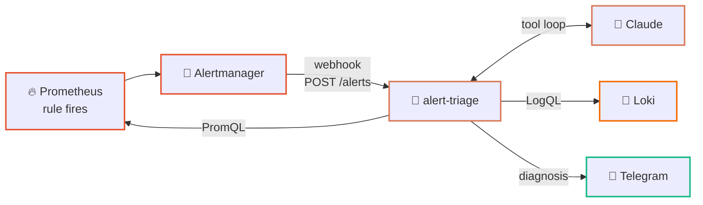

<div align="center">

# 🔎 alert-triage

**An Alertmanager webhook that answers "what is actually going on" instead of forwarding a threshold.**


</div>

---

A raw alert tells you a threshold was crossed. It does not tell you whether the battery
is dying, whether it has been dying for three nights, or whether the exporter simply
stopped reporting. Someone has to open Grafana and find out — usually at 3am.

This service does that first pass. Alertmanager POSTs a firing alert to it; it hands the
alert to Claude along with three **read-only** tools — instant PromQL, range PromQL, and
LogQL — and lets the model decide what to correlate. What lands in Telegram is a
diagnosis with the numbers behind it.

```text
PandoraLowBatteryVoltage: 11.6V          ← what Alertmanager sends

Voltage has fallen a little each night for three nights (12.4 → 11.6V),      ← what lands
and never recovers because the engine hasn't run in four days — mileage      in Telegram
is flat over the window. GSM is still reporting every 10s, so the module
is awake and drawing. That pattern is a parasitic load, not a flat battery
or a dead sensor. Fairly confident. Next: check what stays powered with
the ignition off before the voltage crosses the 11.0V cranking floor.
```

Loki holds the cabinet's own event feed alongside the stack's container logs, so the agent's
LogQL tool can reach for `{job="pandora"}` and find that a door opened two minutes before the
voltage sagged — no change to the agent was needed for that, it simply has more to read.

Nothing here is vehicle-specific. Point `PROMETHEUS_URL` / `LOKI_URL` at any stack and
it triages whatever alerts you route to it.

> 📖 For why this is an agent rather than an MCP server, and how the two fit together, see
> **[Agent and MCP: who owns the loop](../docs/agent-and-mcp.md)**.

---

## 🗺️ How it works



The agent loop is written out by hand rather than using the SDK's (beta) tool runner:
it is the part worth reading, it pins the tool surface to a read-only allowlist, and it
keeps the service on the stable Messages API. It is ~40 lines in
[`triage_agent.py`](triage_agent.py) — call the model, execute any `tool_use` blocks,
feed the results back, repeat until the model answers or the round budget runs out.

Three details that matter in production:

- **The webhook acknowledges immediately** and triages in the background. A triage round
  takes far longer than Alertmanager's webhook timeout, and a slow 200 means retries and
  duplicate work.
- **Tool failures are returned to the model**, not raised — with `is_error: true`, so it
  can adapt (try a different query) instead of the whole triage dying on one bad PromQL.
- **Tool output is truncated** before it enters the context window. A careless
  `{job="docker"}` over an hour is megabytes of logs.

---

## 🧠 Which model runs it

The loop is model-agnostic. `TRIAGE_BACKEND=anthropic` (default) uses the Claude API;
`openai` reaches anything speaking OpenAI chat-completions — **Ollama, vLLM, llama.cpp's
server, LM Studio** — so the same agent can run against a model on your own hardware, with
no outbound traffic at all.

```bash
# Against a model you host — see the local-model profile in compose-stack/
TRIAGE_BACKEND=openai
TRIAGE_BASE_URL=http://ollama:11434/v1
TRIAGE_MODEL=qwen2.5:7b-instruct
```

Each backend only translates its own wire format to and from a neutral `Turn`; the loop
itself never learns which one it is talking to. Plain `requests` rather than the `openai`
SDK — the surface used is one POST, and the image stays small enough for a Raspberry Pi.

> [!WARNING]
> **Pick a model that can actually call tools, and verify it does.** Measured here on
> `qwen2.5:1.5b`: it produced a fluent, confident diagnosis complete with quoted "query
> output" — and made **zero tool calls**. Not one request reached Prometheus. Every number
> in it was invented.
>
> That failure is silent by default, so the agent now guards against it: an answer produced
> without a single query is delivered with an **⚠ Unsourced** banner rather than passed off
> as a diagnosis (`TRIAGE_FLAG_UNSOURCED=0` to disable). Treat that banner as "this model is
> too small for this job".
>
> Also budget the wall clock: that 1.5B turn took **~9.5 minutes on CPU**. Hence
> `TRIAGE_MODEL_TIMEOUT`, which defaults to 900s.

---

## ⚙️ Configuration

| Var | Required | Default | Notes |
|---|:---:|---|---|
| `TRIAGE_BACKEND` | – | `anthropic` | `anthropic` or `openai` |
| `ANTHROPIC_API_KEY` | ✅¹ | – | Required for the `anthropic` backend; service exits without it |
| `TRIAGE_BASE_URL` | ✅² | `http://ollama:11434/v1` | OpenAI-compatible endpoint |
| `TRIAGE_API_KEY` | – | `not-needed` | Sent as a bearer token; Ollama ignores it, vLLM may not |
| `TRIAGE_MODEL_TIMEOUT` | – | `900` | Ceiling for one model call — local inference is slow |
| `TRIAGE_FLAG_UNSOURCED` | – | `1` | Mark answers produced without any query |
| `PROMETHEUS_URL` | – | `http://prometheus:9090` | |
| `LOKI_URL` | – | `http://loki:3100` | |
| `TELEGRAM_BOT_TOKEN` / `TELEGRAM_CHAT_ID` | – | – | Unset → the diagnosis goes to the log instead |
| `TRIAGE_MODEL` | – | `claude-opus-5` / `qwen2.5:7b-instruct` | Default follows the backend |
| `TRIAGE_EFFORT` | – | `medium` | `low`…`max`; raise for messier stacks |
| `TRIAGE_MAX_TOOL_ROUNDS` | – | `8` | Hard ceiling on the loop |
| `TRIAGE_PORT` | – | `9099` | |

¹ `anthropic` backend only.  ² `openai` backend only.

---

## 🚀 Run

Inside the stack, as a compose profile:

```bash
cd ../compose-stack
export ANTHROPIC_API_KEY=sk-ant-...
docker compose --env-file .env.demo --profile demo --profile triage up -d --build
```

Then point Alertmanager at it — in `compose-stack/alertmanager/alertmanager.yml` the
`triage` receiver already exists; change `route.receiver` to `triage` and restart
Alertmanager.

Standalone:

```bash
pip install -r requirements.txt
export ANTHROPIC_API_KEY=sk-ant-... PROMETHEUS_URL=http://localhost:9090 LOKI_URL=http://localhost:3100
python triage_agent.py
```

Fire a test alert without waiting for a real one:

```bash
curl -s localhost:9099/alerts -H 'Content-Type: application/json' -d '{
  "alerts": [{
    "status": "firing",
    "startsAt": "2026-01-01T00:00:00Z",
    "labels": {"alertname": "PandoraLowBatteryVoltage", "severity": "warning", "device_id": "1234567890"},
    "annotations": {"summary": "Battery voltage 11.6V (engine off)"}
  }]
}'
```

The diagnosis appears in `docker compose logs alert-triage` (or in Telegram, if configured).

---

## 🔐 Notes

- **Read-only by construction.** The three tools only run queries. The agent cannot
  restart a service, silence an alert, or write to the vehicle — the exporter itself is
  read-only too.
- **Alert content is data, not instructions.** Labels and annotations come from your own
  rule files, and log lines come from whatever is running in the stack. The system prompt
  frames them as evidence to investigate, and the tool allowlist bounds what the model
  can do regardless of what a log line says.
- **The API key stays in the service.** It is never sent to Prometheus, Loki, or Telegram.
- **Cost is bounded** by `TRIAGE_MAX_TOOL_ROUNDS` and by Alertmanager's own grouping —
  `group_interval` and `repeat_interval` decide how often a flapping alert can trigger a
  triage round. Tune them before pointing this at a noisy stack.
