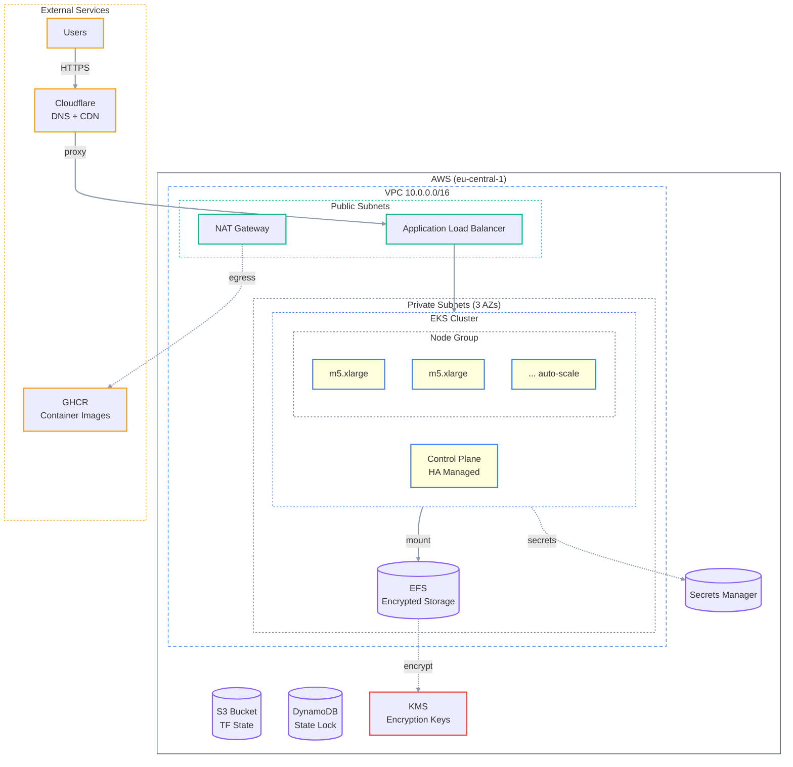
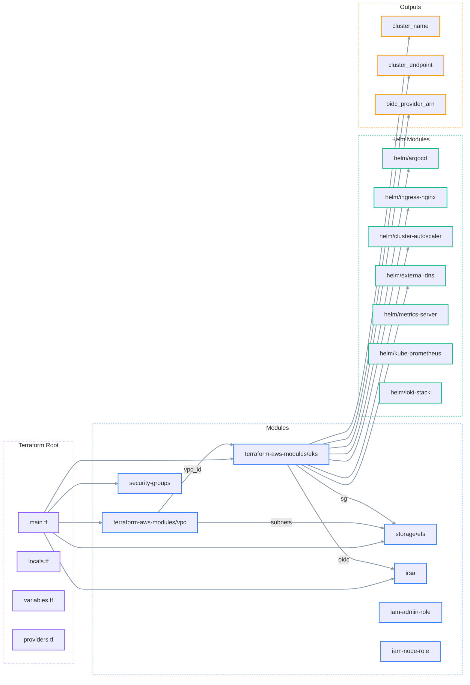
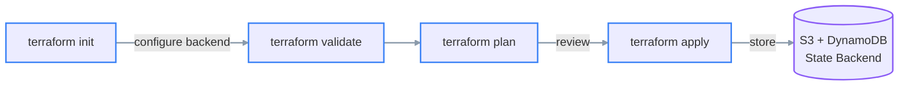
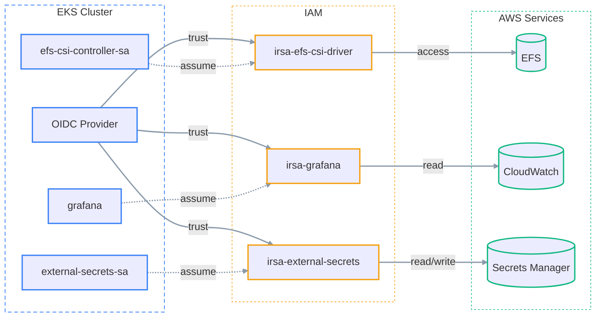

<div align="center">

# ☁️ AWS EKS Platform (Terraform)

**A production-grade EKS landing zone as code — VPC, managed EKS, EFS, IRSA, and platform add-ons.**


</div>

---

Infrastructure as Code for a production EKS environment on AWS: VPC, EKS cluster, EFS storage, IRSA roles, and platform add-ons (ArgoCD, ingress-nginx, cluster-autoscaler, external-dns, cert-manager, kube-prometheus, Loki).

> [!IMPORTANT]
> This is a **template**. Copy each `*.tfvars.example` to a real (gitignored) `*.tfvars` and fill in your own values — AWS account, region, backend bucket/table, domains, and secrets. Nothing here contains a live credential.

---

## Infrastructure Overview



---

## Module Architecture



---

## What This Deploys

| Resource | Configuration | Details |
|----------|---------------|---------|
| VPC | `10.0.0.0/16` | 3 AZs, public + private subnets |
| EKS Cluster | Managed control plane | K8s with OIDC for IRSA |
| Node Group | `m5.xlarge` | Auto-scaling worker nodes |
| EFS | Encrypted, multi-AZ | Shared storage with CSI driver |
| NAT Gateway | Single (cost-optimized) | Egress for private subnets |
| Security Groups | Node + ALB isolation | VPC-scoped ingress/egress rules |
| IRSA Roles | EFS CSI, Grafana, External Secrets | Pod-level IAM permissions |
| ArgoCD | Helm chart | GitOps controller |
| Ingress NGINX | Helm chart | ALB-backed ingress controller |
| Cluster Autoscaler | Helm chart | Node auto-scaling |
| External DNS | Helm chart | Cloudflare DNS automation |
| cert-manager | Helm chart | TLS certificate automation |

---

## Prerequisites

- Terraform >= 1.5
- AWS account with appropriate IAM permissions
- S3 bucket + DynamoDB table for state backend
- Cloudflare API tokens (external-dns, cert-manager)
- GHCR credentials for image pulls

---

## Directory Layout

```text
aws-eks-platform/
├── envs/
│   └── prod/
│       ├── main.tf              # Root composition
│       ├── locals.tf            # Environment defaults
│       ├── variables.tf         # Input variables
│       ├── outputs.tf           # Cluster outputs
│       ├── providers.tf         # AWS/K8s/Helm providers
│       ├── vpc.tf               # VPC module invocation
│       ├── k8s-post.tf          # Post-deploy K8s resources
│       ├── secrets.tf           # K8s secrets configuration
│       ├── aws-lb-controller.tf # ALB controller setup
│       ├── cluster-autoscaler.tf
│       └── terraform.tfvars.example  # copy -> terraform.tfvars (gitignored)
├── global-backend/
│   ├── main.tf                  # S3 + DynamoDB for state
│   └── variables.tf
└── modules/
    ├── storage/efs/             # EFS file system + mount targets
    ├── irsa/                    # IAM roles for service accounts
    ├── iam-admin-role/          # Admin assume-role
    ├── iam-node-role/           # Node instance profile
    ├── security-groups/         # VPC security groups
    │   └── alb/                 # ALB-specific rules
    └── helm/
        ├── argocd/              # ArgoCD Helm values
        ├── ingress-nginx/       # Ingress controller
        ├── cluster-autoscaler/  # Node autoscaler
        ├── external-dns/        # DNS automation
        ├── kubernetes-metrics-server/
        ├── kube-prometheus/     # Monitoring stack
        ├── loki-stack/          # Log aggregation
        └── aws-lb-controller/   # AWS LB controller
```

---

## Workflow



```bash
# Navigate to environment
cd aws-eks-platform/envs/prod

# Initialize backend
terraform init

# Validate configuration
terraform validate

# Plan changes
terraform plan -out=tfplan

# Apply changes
terraform apply tfplan
```

---

## IRSA (IAM Roles for Service Accounts)



| Service Account | IAM Role | Permissions |
|-----------------|----------|-------------|
| `efs-csi-controller-sa` | `irsa-efs-csi-driver` | EFS create/delete access points |
| `grafana` | `irsa-grafana` | CloudWatch metrics/logs read |
| `external-secrets-sa` | `irsa-external-secrets` | Secrets Manager read/write |

---

## Configuration

Key inputs in `terraform.tfvars` and `locals.tf`:

| Setting | Location | Description |
|---------|----------|-------------|
| `project` | `locals.tf` | Project name prefix (`tobrazo`) |
| `env` | `locals.tf` | Environment (`prod`) |
| VPC CIDR | `vpc.tf` | `10.0.0.0/16` |
| Availability Zones | `vpc.tf` | `eu-central-1a/b/c` |
| Cloudflare tokens | `terraform.tfvars` | DNS/cert-manager API tokens |
| ArgoCD hostname | `locals.tf` | `argocd.example.com` |
| App secrets | `terraform.tfvars` | B2B and NestJS backend secrets |

---

## Security Notes

- State backend encrypted with S3 SSE and DynamoDB for locking
- EFS encrypted with customer-managed KMS key
- Worker nodes in private subnets only
- ALB security group restricts inbound to HTTPS
- IRSA provides pod-level IAM without node credentials
- Secrets stored in AWS Secrets Manager, not in Git

---

## Post-Deployment Resources

Terraform also creates Kubernetes resources after cluster provisioning:

- **ClusterIssuer** for Let's Encrypt DNS validation via Cloudflare
- **ArgoCD Root Application** pointing to `gitops/envs/prod` for GitOps bootstrap

---

## Recommendations

- [ ] Enable multi-NAT for production HA
- [ ] Add VPC Flow Logs for network visibility
- [ ] Implement Terraform Cloud for PR-based workflows
- [ ] Restrict `api_allow_cidrs` from `0.0.0.0/0`
- [ ] Add network policies for pod isolation
- [ ] Set up CloudWatch alarms for EKS/EFS metrics
