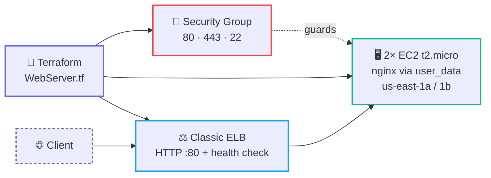

<div align="center">

# 🖥️ Terraform AWS Web Server

**Two nginx web servers behind a Classic Load Balancer on AWS — provisioned end-to-end with Terraform.**


</div>

---

A minimal, self-contained Terraform module that stands up a small highly-available web tier on **AWS** (`us-east-1`): two `t2.micro` EC2 instances spread across two availability zones, each bootstrapped with **nginx** via `user_data`, all fronted by a Classic Elastic Load Balancer with health checks and connection draining.

---

## 🏗️ Architecture



---

## 🧱 What it provisions

| Resource | Details |
|----------|---------|
| `aws_instance.tobrazo_webserver` | **2×** `t2.micro` EC2 instances (via `count`), one in `us-east-1a` and one in `us-east-1b`. Each runs the `userdata.tpl` cloud-init script. |
| `aws_elb.tobrazo_elb` | Classic ELB listening on **HTTP :80**, forwarding to instance port 80. Cross-zone LB, connection draining (400s), `HTTP:80/` health check. |
| `aws_security_group.tobrazo_webserver` | Ingress **80 / 443** from anywhere and **22** from an admin CIDR; all egress open. |

The `userdata.tpl` bootstrap installs nginx and writes a per-instance landing page:

```bash
apt -y update && apt -y install nginx
echo "Hello from ${instance_name}" > /var/www/html/index.html
systemctl start nginx
```

---

## ⚙️ Configuration

> [!NOTE]
> This module currently **hardcodes** its settings — there are no `variable` blocks yet. The one templated input is `instance_name`, passed into `userdata.tpl` as `server1` / `server2`. The values below are what you'd tune inline (or promote to variables) for your own environment.

| Value | Current setting | Purpose |
|-------|-----------------|---------|
| `provider.aws.region` | `us-east-1` | Target AWS region. |
| `count` | `2` | Number of web instances. |
| `ami` | `ami-084568db4383264d4` | Base image (region-specific; public AMI ID). |
| `instance_type` | `t2.micro` | Instance size. |
| `availability_zone` | `us-east-1a`, `us-east-1b` | AZ spread for the instances and ELB. |
| SSH ingress CIDR | `10.10.10.10/32` | Admin source allowed on port 22 — **placeholder, replace with your own**. |

### Outputs

| Output | Value |
|--------|-------|
| `webserver_ip` | Public IPs of both EC2 instances. |
| `elb_dns_name` | Public DNS name of the Classic ELB. |

---

## 🚀 Quick start

```bash
cd terraform/web-server

terraform init      # download the AWS provider
terraform plan      # preview the changes
terraform apply     # create the instances, SG, and ELB
```

Once applied, hit the ELB DNS name from the outputs:

```bash
curl "http://$(terraform output -raw elb_dns_name)"
# → Hello from server1  (or server2)
```

---

## 🔐 Security notes

> [!WARNING]
> The SSH ingress CIDR `10.10.10.10/32` is a **placeholder** (RFC-1918 private range). Replace it with your real admin IP before applying — never widen SSH to `0.0.0.0/0`.

> [!CAUTION]
> Ports **80** and **443** are open to `0.0.0.0/0` (public web tier — expected here). Front real workloads with TLS termination and consider tightening egress. Requires valid AWS credentials in your environment (`AWS_PROFILE` / `AWS_ACCESS_KEY_ID`); **never commit credentials to this repo**.

---

## 🧹 Cleanup

```bash
terraform destroy
```
